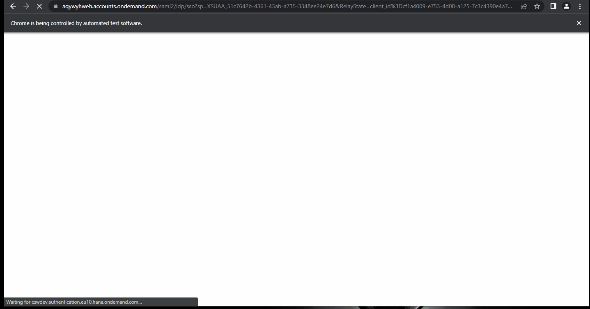

# Tests work fine



# issues Iframe in log
lots of these errors in the browser console
```
Opa has received 500 logs without a consumer - maybe you loaded Opa.js inside of an IFrame? The logs are now cleared to prevent memory leaking
Opa has received 500 logs without a consumer - maybe you loaded Opa.js inside of an IFrame? The logs are now cleared to prevent memory leaking
Opa has received 500 logs without a consumer - maybe you loaded Opa.js inside of an IFrame? The logs are now cleared to prevent memory leaking
`
